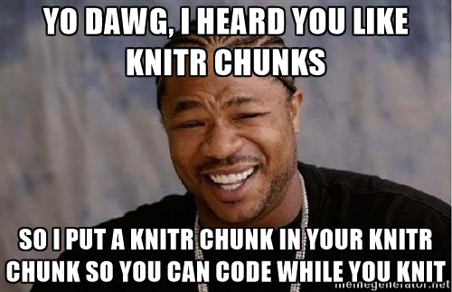

#YAML Headers

##Beamer Slides Presentatino YAML

YAML header to make a slide presentation using beamer, slides 16:9
output:
  beamer_presentation:
    keep_tex: true
classoption: "aspectratio=169"

Add a pause in the presentation\pause

This help page pulls up all of the possible ways to use mathematical latex expressions:
`r ?plotmath`

Three or four dashes in a row (----) indicates a new slide on beamer presentations:

----


```{r setup, include=FALSE}
knitr::opts_chunk$set(echo = TRUE)

#Core R packages
library(readxl)
library(haven)
library(tidyverse)
library(kableExtra)       # HTML tables
library(tableone)         # table 1
library(Hmisc)            # labels and correlations
library(labelled)         # add label names
library(gridExtra)        # allows grid arangement of dissimilar plots together
library(grid)             # add labels to top of grid.arrange plots
library(scales)
library(cowplot)
theme_set(theme_cowplot())
library(citr)             # citation manager using Zotero

# Other R packages
library(xlsx)
library(devtools)
library(mice)             # multiple imputation by chained equations
library(VIM)              # missing data visualization
library(janitor)
library(GGally)           # correlations plot
library(fBasics)          # basic statistics
library(viridis)          # color pallettes
library(gghighlight)      # highlight specific data in ggplot
library(directlabels)     # direct labels (on loess plots)
library(pdftools)         # for reading PDFs into R as text
library(DiagrammeR)       # make diagrams showing NEI-VFQ-25 IRT and CTT hierarchys

# psychometrics R packages
library(ltm)              # Latent Trait Models under IRT

# spatial analysis R packages
library(leaflet)          # plotting spatial data
library(htmlwidgets)      # to save html maps that are interactive
library(sf)               # handle simple features objects
library(ggmap)            # for querying google API for geocoding
library(rgdal)            # function that has the projection dataframe
library(sp)               # required for projections
library(mgcv)             # generalized additive modelling (gam and bam) and generalized additive mixed modelling 
library(fields)           # kriging: easily do image plots to check results
library(spdep)            # areal analysis
```

#R Profile

Global options can be set in the .Rprofile document. Note, always have a trailing empty line.

```{r, include = FALSE}
# edit .Rprofile document
file.edit("~/.Rprofile")
```


#Formatting in Rmd

<span style="color:blue">This is an example of editing the html of the text outside of coding chunks.</span>

add an image into Rmd with the following:
{#id .class width=75% height=75%}


#Data Import and Export

##Set Data Folder

Use this trick to set a common link for the folder directory, then change the subfolder name to access data
```{r import}
# the Rmd file should be in the "Programs" folder

# this changes the directory from the "Programs" to the "Data" folder by substituting strings
data.dir = gsub('/Programs', '/Data', getwd())

# when calling data, instead of changing the directory manually, just call the string substitution to now direct to the "Data" folder, and then the name of the file.
pm25 = read.csv(paste0(data.dir, "/pm25_ca_2018.csv"))
```

##Save and load data frame

```{r}

setwd("/Users/USC/Desktop")

save(data_frame, file = "data_frame")

load("data_frame")
```

#Data Wrangling

##Rename Variables

###Remove Variable Prefix or Suffix

[Blog post](https://www.wtmatthias.com/2017/10/04/find-replace-in-var-names/) explaining how to remove common prefix to many variable names
```{r}
# data_octa_intra_wide_1eye %>% 
#   # get only the first measurements for each individual eye
#   select(SID, Target, starts_with("1_")) %>% mutate(Target = 1) %>% 
#   # remove "1_" prefix from variable names
#   set_names(~stringr::str_replace_all(., "1_", ""))
```

##Replace Values of Variables

```{r}
dataset %>% 
  mutate(
    count_yes_no = case_when(
      yes_no == "Yes" ~ 2,
      yes_no == "No" ~ 0,
      yes_no == "Missing" ~ 0
      )
  )
```


##Spread

```{r}
# data_octa_intra %>% 
#   select(Target, Judge, VAD) %>% 
#   spread(key = Judge, value = VAD)
```

##Multi-Spread

[Multi-spread function](https://kieranhealy.org/blog/archives/2018/11/06/spreading-multiple-values/) by Dan Sullivan
```{r}

multi_spread <- function(df, key, value) {
  
    # quote key
    keyq <- rlang::enquo(key)
    # break value vector into quotes
    valueq <- rlang::enquo(value)
    s <- rlang::quos(!!valueq)
    df %>% gather(variable, value, !!!s) %>%
        unite(temp, !!keyq, variable) %>%
        spread(temp, value)
    
}

# example of call to multispread function
  # dataframe %>%
  #     select(parameter, qol_group, vsqol, estimate, cl_95_low, cl_95_high, p_value) %>% 
  #     multi_spread(key = "parameter", value = c("estimate", "cl_95_low", "cl_95_high", "p_value"))
```

#Programming

[Programming with dplyr](https://dplyr.tidyverse.org/articles/programming.html) requires some nuance that always causes me a pain. This article explains it. Below is an example that works.

```{r}

get_repeatability <- function(df, octa_var){
  
  # intra-visit dataset
  df %>% 
    # select only the eye ID, the eye ID, and the OCTA variable of interest
    select(Target, Judge, !!octa_var) %>% 
    # group by measurement ID
    group_by(Target) %>% 
    # calculate the mean and variance of measurements for each individual
    mutate(
      mean = mean(!!octa_var),
      var = sd(!!octa_var)^2
      ) %>% 
    # convert data to wide and remove grouping by measurement ID
    spread(key = Judge, value = !!octa_var) %>% ungroup() %>% 
    # take the average of mean measurements and the average of the variances
    summarise(
      Xw = mean(mean),
      Sw = sqrt(mean(var))
      ) %>% 
    # square root the variances
    mutate(
      CRw = sqrt(2)*1.96*Sw,
      CVw = 100*Sw/Xw
      )

}

get_repeatability(df = data_octa_intra, octa_var = quo(VAD))
```


[Save a permanent function in r](https://stackoverflow.com/questions/14403332/make-a-user-created-function-in-r), and then load it.
```{r}

# save a permanent function in R
dump("multi_spread", file = "multi_spread.R")

# load a saved function in R
source("multi_spread.R")
```

#Analysis

##Table 1: Sociodemographics

```{r}
## print table 1 in R
AFEDS_restrict %>% 
    select(exposure, outcome_NEIVFQ25_IRT, outcome_NEIVFQ25_CTT, outcome_SF12, covariates_table1)

# function to print select variables for Table 1a
table1a_print <- function(vars, label, end_row){
  
  ## export table 1 to html
  CreateTableOne(data = table1a_data %>% select(vars), factorVars = catVars_table1) %>% 
    print(exact = "stage", quote = FALSE, noSpaces = F, printToggle = F, varLabels = T) %>%
    kableone(digits = 3) %>%
    kable_styling(
      #bootstrap table classes
      bootstrap_options = c("striped", "hover")
    ) %>% 
    pack_rows(label, 2, end_row) 
  
}
```

#Images

##Save an image
```{r}
dev.copy(png, "image.png", width = 600, height = 600, res = 300)
image
dev.off()
```

add an image into Rmd with the following:
{#id .class width=75% height=75%}


#References